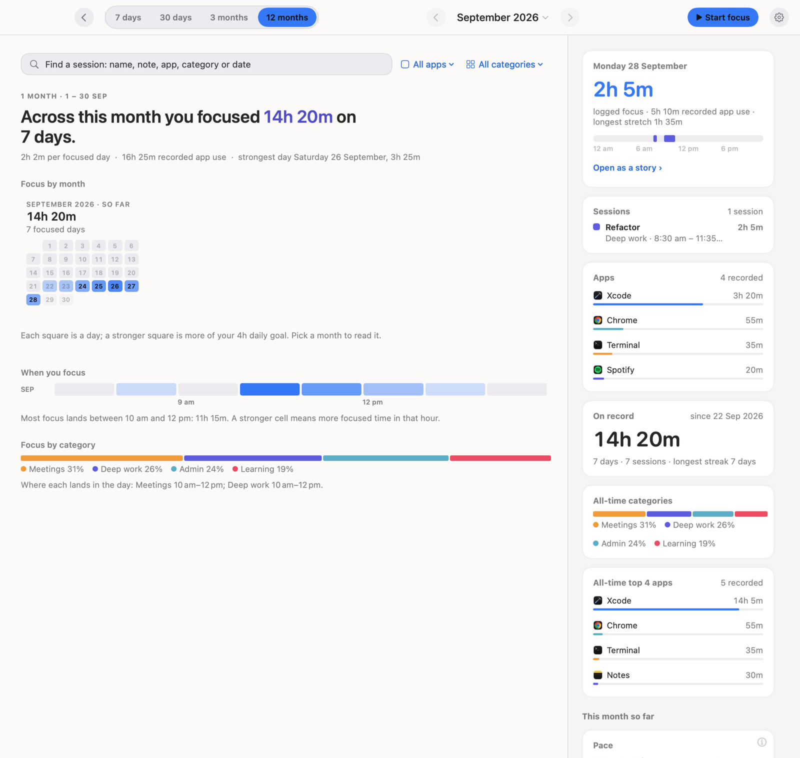

# FocusContinuity

A native macOS focus tracker that refuses to guess. It records focus sessions
and local app use, then tells the day back as a story, keeping what you
declared, what the Mac observed and what nobody recorded as separate,
labelled measures.


**SwiftUI · AppKit · Swift Charts · macOS 13+** ·
no Xcode project, no packages, no network, no telemetry ·
hundreds of headless checks

## Why it exists

Most time trackers treat "the app was in front" as "you were working". That
turns a locked screen, a meeting away from the desk or a laptop left open over
lunch into invented productivity. FocusContinuity is built around one rule:
**evidence comes before interpretation.**

- A focus session is something you declare. App use is something the Mac
  observed. They are never added together.
- When you step away, the app asks what happened instead of deciding for you.
- Where nothing was recorded, the story says so.

## Screenshots

| History, 3 months, dark appearance | History, 12 months, a day picked |
|---|---|
|  |  |

| Menu bar | Away decision |
|---|---|
|  |  |

## The hard parts

**An honest time model.** The app keeps related measures apart and names each
one on screen:

| Measure | Meaning |
|---|---|
| **Focused** | Declared focus-session time, clipped to the day or period shown |
| **Focused-active** | Focus that overlaps observed hands-on app use; the only time that earns goal credit |
| **Recorded app use** | Observed foreground time; never presented as deliberate work |
| **Focus without app-use coverage** | Session time the recorder cannot corroborate; disclosed, never added to Mac use |
| **Break / Away** | Explicit rest or absence; never counted as focus |

A session that crosses midnight contributes only its share to each day. A
logged total can exceed recorded app use, and the Day view explains why rather
than hiding the difference.

**Absence without guessing.** Locks, sleep and idle time end in a decision:
break, working, away or start fresh. While a decision is open, every other
session action routes back to it, including the global hotkey. Corrections
(rename, change type, re-answer an away) apply to the whole thread across days,
never move time boundaries, survive relaunch, and can be undone field by field.
Writes are atomic, a failed save keeps the old record and offers Retry, and an
interrupted write cannot record the same interval twice.

**Data that ages honestly.** App-use history is a versioned envelope with an
accuracy epoch. Data recorded before a recorder fix is preserved and marked as
less certain wherever an exact claim would mislead; it is never silently
rewritten. Older formats are backed up byte for byte before migration.

**Cheap to leave running.** A menu bar app runs all day, so idle cost matters.
Profiling showed that SwiftUI windows keep re-rendering on every data update
even when closed, and the hidden menu bar panel alone was costing about 45 ms
of work each second. Closed windows and panels now rest until shown again, and
the app's CPU use during normal work went from 0.9% to 0.1%.

**Private by construction.** Everything stays on the Mac. The app stores app
identity and time ranges, never content. It asks for no Accessibility,
Automation, Screen Recording or Input Monitoring permission; idle detection
uses system counters, not event content. The prompts you will see are
notifications (at first launch, for break reminders), and microphone and
speech recognition (only when you dictate a note). Launch at login, if you turn
it on, adds a login item.

## How it is verified

- **Hundreds of headless checks** run from the app binary itself (`--selftest`). They
  use an injected clock, isolated preferences and temporary archives, so they
  cover session state transitions, cross-midnight clipping, wake and presence
  handling, persistence failures, accuracy epochs, corrections and Undo,
  accessibility targets and settings effects without touching real data.
- **A snapshot matrix** renders every surface in light, dark and system
  appearance through offscreen AppKit hosting, with real native controls, for
  visual review (`--snapshot`). The screenshots above come from it.
- **A fixture-only app** (`scripts/build-fixture-app.sh`) has its own bundle
  identifier and cannot open real data, so native UI automation can run safely.
- **The build is strict**: Swift 5 mode with warnings as errors, a strict deep
  signature check, and tests run before the local app is replaced. If anything
  fails, including during the swap, the previous app is put back.

## How the work is organised

Features move through written documents before and after the code, and all of
them are in [`docs/`](docs):

1. **Spec**: the problem, the decisions and what is out of scope.
   Example: [honest session time](docs/specs/2026-08-17-honest-session-time-design.md).
2. **Plan**: small, testable steps with the checks each one must pass.
   Example: [complete Story interactions](docs/plans/2026-08-31-complete-story-interactions.md).
3. **Review**: an audit against the spec, then verification of every finding.
   Example: [design and behaviour audit](docs/reviews/2026-08-31-design-and-behaviour-audit.md)
   and its [remediation verification](docs/reviews/2026-08-31-story-remediation-verification.md).

[`PRODUCT.md`](PRODUCT.md) holds the product principles and
[`DESIGN.md`](DESIGN.md) the design system. Commit messages describe
the change they make, so `git log` reads as a changelog. The code is also kept lean on
purpose: a recent pass removed about 7,300 lines of views, members and build
machinery that nothing used any more, with no change in behaviour.

## Features

- The day told as a story, with its goal, app use, rhythm and streak beside
  it; a calendar jumps to any recorded day
- Focus sessions with pause, away, breaks and threads you can continue later
- Optional activity rules that start sessions from the apps you use, always
  saying why and offering Undo
- History over the last 7 or 30 days, 3 or 12 months, or any span you pick,
  grouped by day, week or month to suit, back to the first recorded day
- Search first in History: sessions by name, note, app, category or date (⌘F)
- History states only what the record supports: focus trend, a
  when-you-focus grid, category shares and goal rates
- Custom categories with icons, colours, daily goals and break reminders
- Session notes with in-app dictation, full session reports and named breaks
- Awards derived from recorded evidence, with their criteria shown
- A twelve-chapter first-run tour that can be skipped or replayed
- Full keyboard operation, VoiceOver labels, light and dark appearance

The full guide to every surface and control is in [docs/usage.md](docs/usage.md).

## Build and run

Requirements: macOS 13 or later and the Apple Command Line Tools (`swiftc`).
Xcode is not needed.

```bash
./build.sh          # Build and replace the local app after verification
./build.sh --run    # Build, verify and open FocusContinuity.app
./build.sh --test   # Build, run the checks, then replace the local app
./build.sh --check  # Build and run the checks without replacing the app
```

The app is ad-hoc signed for local use; it is not notarised or distributed.
Builds that replace the local app take a lock at `.build/promotion.lock`, so a
second build waits its turn. If a build is killed outright, remove that
directory once no build is running.

## Architecture

```text
Core                     App                            Design / Surfaces
──────────────────      ───────────────────────────    ──────────────────────────
SessionEngine            AppCoordinator                 MainWindowView / native sheets
AppUsageTracker          SessionStore (+ read models)   Story columns / rail / calendar
AppUsageArchive          SettingsModel                  History / Insights / Awards
DailyGoal                MainWindowModel                Focus / Settings / Popover
PeriodStats              Persistence wiring             Tokens / StoryStyle / controls
PresenceGate             Day and History projections    Away / Reward
StoryChronology
DateFormats
```

- **Core** is UI-free: the session state machine, usage tracking, clipping,
  goals, periods, persistence formats and pure calculations.
- **App** owns macOS event wiring and publishes read models. It is the only
  boundary for session actions, settings, refresh coalescing and navigation.
- **Design / Surfaces** renders those models. Views never read storage or
  recalculate time.

One one-second ticker, in `SessionStore`, drives presence checks, usage
checkpoints, live figures and break evaluation. The UI adds no timers of its
own.

Data lives in `~/Library/Application Support/FocusContinuity/`:
`sessions.json` for sessions and `app-usage.json` (a versioned v2 envelope)
for app use, both written atomically.

## Repository layout

```text
Sources/
  Core/                 Time accounting, persistence, periods and pure models
  App/                  macOS coordination, SessionStore and settings/navigation
  Design/               Semantic tokens and reusable SwiftUI components
  Surfaces/             Screens, popover, prompts, gallery and snapshots
  Verification/         Focused regression groups and isolated native-window mode
  SelfTest.swift        Headless check suite
build.sh                Build, signing, checks and local install
scripts/                Fixture-only native verification
docs/                   Specs, plans, reviews, design references and screenshots
```

## Contributing

Keep the Core → App → Design/Surfaces boundary intact. Add a focused headless
check before changing behaviour, preserve recorded evidence rather than
rewriting it, and run `./build.sh --check` before committing.

## License

MIT. See [LICENSE](LICENSE).
